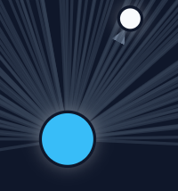

</img>

# Web Graph Visualizer.. web-grapher
The Web Graph Visualizer is a tool designed to map the internal structure of websites.
By entering a target URL, the application crawls the site and generates an interactive, force-directed graph.
This visualization helps users understand how pages within a domain are interconnected.

# Deployed on Render
[web-grapher](https://web-grapher.onrender.com)

# Example

<video src="example/example.mp4" width="100%">
  Your browser does not support the video tag.
</video>

## Features
- **Automated Crawling**: The system systematically explores the internal links of a provided domain.
- **Interactive Visualization**: Built using D3.js, the graph allows users to drag, zoom, and explore nodes.
- **In-Memory Caching**: Results are cached to provide faster responses for frequently mapped sites.
- **Redis Integration**: For production deployments, the backend supports Redis to maintain cache persistence across server restarts.
- **Rate Limiting**: Built-in concurrency control protects the server and the target website from being overwhelmed by requests.

## Architecture
The project consists of two main components:

1. **Backend (Go/Fiber)**: A high-performance server that handles web requests, performs the crawling logic, and serves static files.

2. **Frontend (HTML/CSS/JS)**: A client-side interface that renders the D3.js graph and manages user interactions via an intuitive UI.

## Local Development

To run the project locally, follow these steps:

1. Prerequisites: Ensure you have Go installed on your machine.

2. Setup: Clone the repository and navigate to the project root.

3. Run: Execute the following commands in your terminal:
    ```
      go mod tidy
      go run main.go
    ```
4. Access: Open your browser and navigate to http://localhost:3000.

## Technical Details

* Crawler: Utilizes the Colly library for efficient and structured web scraping.

* Server: Uses the Fiber framework for routing and HTTP management.

* Visualization: Uses D3.js to calculate forces, collisions, and positions for node rendering.

* Styling: Uses Tailwind CSS for a modern, responsive user interface.

## Project Structure
* main.go: The central Go server and crawler logic.

* public/index.html: The main entry point for the frontend.

* public/styles/main.css: Stylesheet for the application interface and glassmorphism components.

* public/scripts/app.js: The JavaScript logic for D3.js graph generation and UI event handling.
